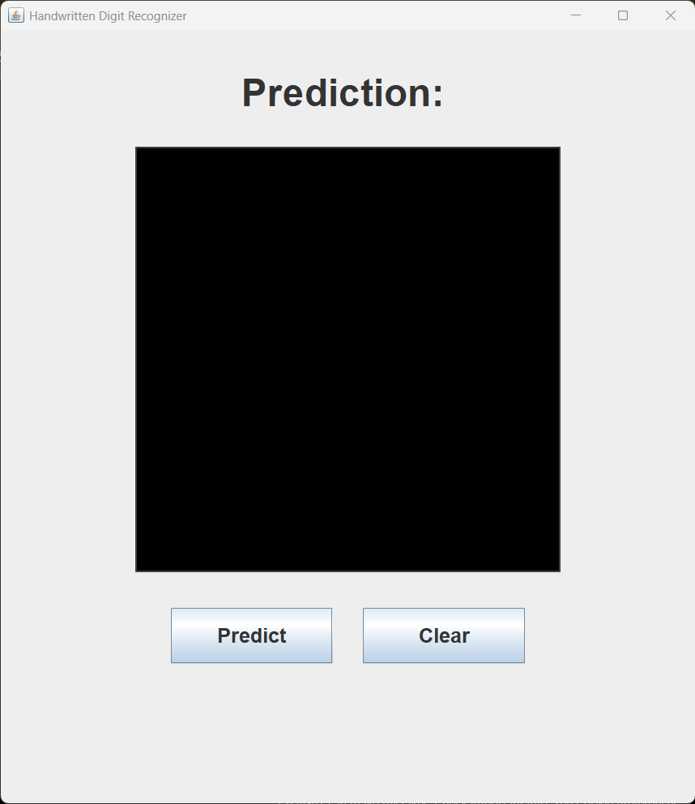
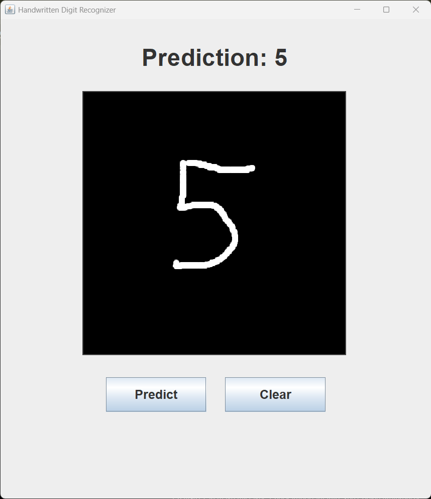
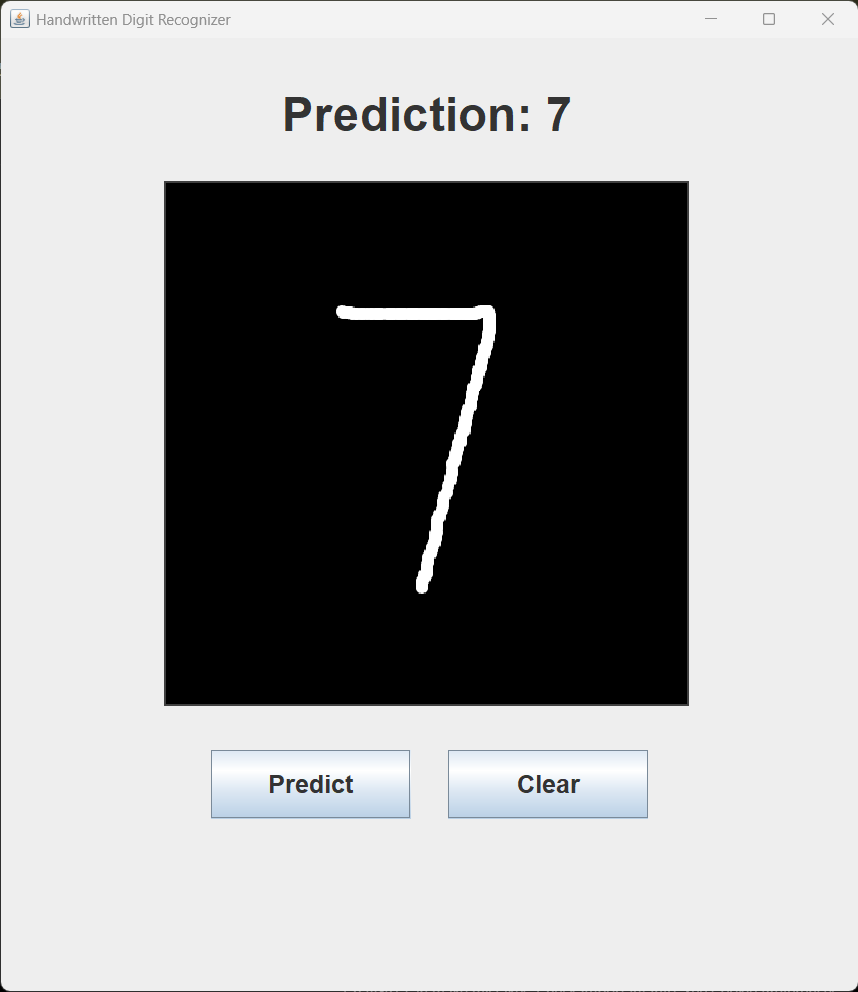

# Handwritten Digit Recognition

A CNN-based handwritten digit recognition system built with Java, Swing, DeepLearning4j, and the MNIST dataset.

This application allows users to draw handwritten digits in a desktop GUI and predicts the digit in real time using a trained Convolutional Neural Network (CNN).


# Features

* Real-time handwritten digit recognition
* Interactive drawing canvas
* CNN-based deep learning model
* Trained on the MNIST dataset
* Java Swing desktop GUI
* Embedded trained model inside executable JAR
* Executable standalone application support

# Technologies Used

* Java 21
* Spring Boot
* DeepLearning4j (DL4J)
* ND4J
* Swing
* Maven
* MNIST Dataset


# CNN Architecture

The model uses a Convolutional Neural Network (CNN):

```text
Input (28x28x1)
    ↓
Convolution Layer
    ↓
Max Pooling Layer
    ↓
Dense Layer
    ↓
Softmax Output Layer
```

This architecture significantly improves handwritten digit recognition accuracy compared to a standard dense neural network.


# Model Accuracy

| Metric    | Score  |
| --------- | ------ |
| Accuracy  | 98.4%  |
| Precision | 98.4%  |
| Recall    | 98.39% |
| F1 Score  | 98.39% |


# Screenshots

## Main UI



## Prediction Example - 5



## Prediction Example - 7




# Project Structure

```text
digit-recognition/
│
├── screenshots/
├── src/
│   ├── main/
│   │   ├── java/
│   │   └── resources/
│   │       └── mnist-model.zip
│   └── test/
│
├── pom.xml
├── mvnw
├── mvnw.cmd
└── README.md
```


# How to Run

## Clone Repository

```bash
https://github.com/althaffazil/handwritten-digit-recognition
```


## Build Project

Windows:

```powershell
.\mvnw clean package
```

Mac/Linux:

```bash
./mvnw clean package
```


## Run Application

```bash
java -jar target/digit-recognition-0.0.1-SNAPSHOT.jar
```


# How It Works

1. User draws a digit on the canvas
2. The image is preprocessed
3. The CNN model predicts the digit
4. Prediction is displayed instantly


# Image Preprocessing

The application performs:

* digit boundary detection
* cropping
* aspect ratio preservation
* resizing to 28x28
* centering normalization

This preprocessing helps align user drawings with the MNIST training dataset format.

